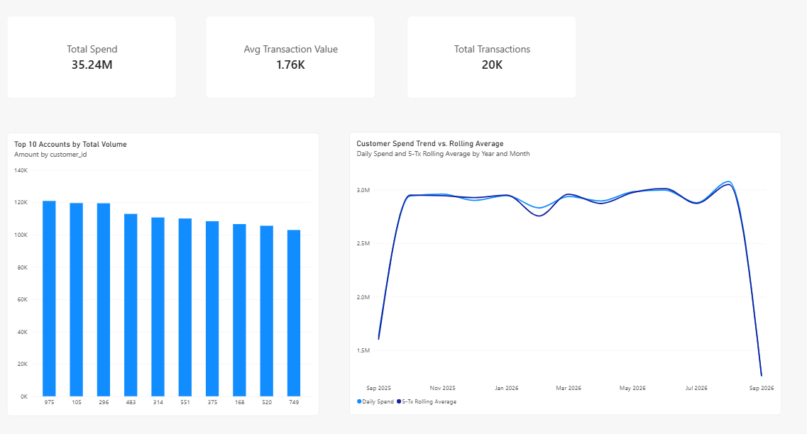
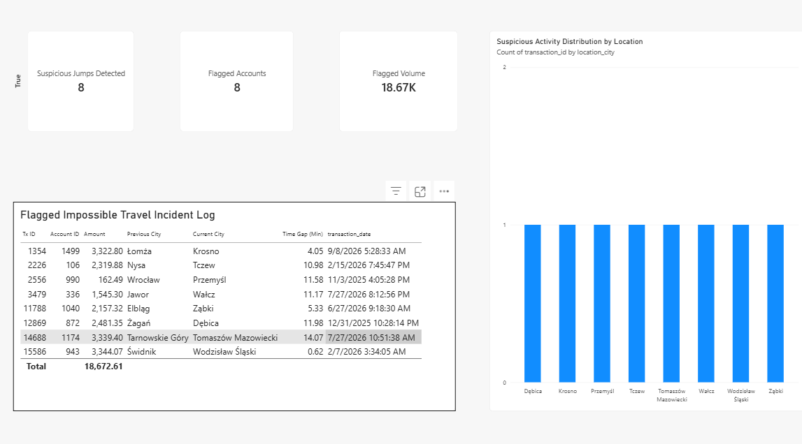

# Enterprise Banking Data Pipeline & Analytics Platform

An end-to-end, production-ready banking analytics platform built with **Python**, **PostgreSQL**, and **Power BI**. The architecture handles automated real-time data cleansing via procedural triggers, auditing of core financial state changes, advanced SQL window functions for fraud detection and financial velocity analysis, and interactive executive reporting.

## System Architecture & Workflow

[INSERT YOUR SYSTEM ARCHITECTURE DIAGRAM HERE]

1. **Ingestion Engine (`Python`)**: Generates normalized, relational records for customers, accounts, cards, and transactions.

2. **In-Flight Sanitation & Audit (`PostgreSQL Triggers`)**: Cleanses, standardizes, and validates incoming data on-the-fly while logging account balance changes to an isolated audit log.

3. **Analytics & Transformation (`SQL Views`)**: Leverages advanced window functions (`LAG`, `SUM OVER`, `AVG OVER`, `DENSE_RANK`, `ROW_NUMBER`) to calculate customer spending velocity, temporal fraud indicators (*Impossible Travel*), and user activity rankings.

4. **Business Intelligence (`Power BI`)**: Visualizes financial KPIs, spending trends, and risk anomaly alerts in real time.

## Deep-Dive: PostgreSQL Data Engineering & Database Specification

All heavy data transformation logic is pushed down to the database level to ensure optimal query execution speed and to minimize memory overhead during Business Intelligence reporting.

### 1. Automated In-Flight Data Sanitation Triggers

To guarantee strict data quality before analytical processing, procedural `BEFORE INSERT OR UPDATE` triggers clean, standardize, and sanitize input fields.

```sql
-- ---------------------------------------------------------------------
-- 1. CUSTOMER DATA SANITATION
-- ---------------------------------------------------------------------
CREATE OR REPLACE FUNCTION fn_clean_customer_data()
RETURNS TRIGGER AS $$
BEGIN
    -- Strip whitespace from names
    IF NEW.first_name IS NOT NULL THEN
        NEW.first_name := TRIM(NEW.first_name);
    END IF;
    
    IF NEW.last_name IS NOT NULL THEN
        NEW.last_name := TRIM(NEW.last_name);
    END IF;

    -- Standardize email address (lowercase & trim) or fallback to system default
    IF NEW.email IS NOT NULL THEN
        NEW.email := LOWER(TRIM(NEW.email));
    ELSE
        NEW.email := 'missing_email_' || COALESCE(NEW.pesel, RANDOM()::TEXT) || '@bank.pl';
    END IF;

    RETURN NEW;
END;
$$ LANGUAGE plpgsql;

DROP TRIGGER IF EXISTS trg_clean_customer_before_save ON customers;
CREATE TRIGGER trg_clean_customer_before_save
BEFORE INSERT OR UPDATE ON customers
FOR EACH ROW
EXECUTE FUNCTION fn_clean_customer_data();


-- ---------------------------------------------------------------------
-- 2. CARDS DATA SANITATION
-- ---------------------------------------------------------------------
CREATE OR REPLACE FUNCTION fn_clean_card_data()
RETURNS TRIGGER AS $$
BEGIN
    -- Remove hyphens and whitespace from credit card numbers
    IF NEW.card_number IS NOT NULL THEN
        NEW.card_number := REPLACE(REPLACE(NEW.card_number, '-', ''), ' ', '');
    END IF;

    -- Default active status if null
    IF NEW.is_active IS NULL THEN
        NEW.is_active := TRUE;
    END IF;

    RETURN NEW;
END;
$$ LANGUAGE plpgsql;

DROP TRIGGER IF EXISTS trg_clean_card_before_save ON cards;
CREATE TRIGGER trg_clean_card_before_save
BEFORE INSERT OR UPDATE ON cards
FOR EACH ROW
EXECUTE FUNCTION fn_clean_card_data();


-- ---------------------------------------------------------------------
-- 3. TRANSACTIONS SANITATION & FRAUD PRE-SCREENING
-- ---------------------------------------------------------------------
CREATE OR REPLACE FUNCTION fn_clean_transaction_data()
RETURNS TRIGGER AS $$
BEGIN
    -- Trim whitespace from city and uppercase country ISO codes
    IF NEW.location_city IS NOT NULL THEN
        NEW.location_city := TRIM(NEW.location_city);
    END IF;

    IF NEW.location_country IS NOT NULL THEN
        NEW.location_country := UPPER(TRIM(NEW.location_country));
    END IF;

    -- Intercept negative amounts and flag as potential fraud
    IF NEW.amount < 0 THEN
        NEW.amount := ABS(NEW.amount);
        NEW.status := 'FLAGGED_FRAUD';
    END IF;

    RETURN NEW;
END;
$$ LANGUAGE plpgsql;

DROP TRIGGER IF EXISTS trg_clean_transaction_before_save ON transactions;
CREATE TRIGGER trg_clean_transaction_before_save
BEFORE INSERT OR UPDATE ON transactions
FOR EACH ROW
EXECUTE FUNCTION fn_clean_transaction_data();


-- ---------------------------------------------------------------------
-- 4. ACCOUNTS DATA SANITATION
-- ---------------------------------------------------------------------
CREATE OR REPLACE FUNCTION fn_clean_account_data()
RETURNS TRIGGER AS $$
BEGIN
    -- Remove whitespace from account numbers (IBAN/BBAN format)
    IF NEW.account_number IS NOT NULL THEN
        NEW.account_number := REPLACE(NEW.account_number, ' ', '');
    END IF;

    -- Force upper-case for currency and account type
    IF NEW.currency IS NOT NULL THEN
        NEW.currency := UPPER(TRIM(NEW.currency));
    END IF;

    IF NEW.account_type IS NOT NULL THEN
        NEW.account_type := UPPER(TRIM(NEW.account_type));
    END IF;

    RETURN NEW;
END;
$$ LANGUAGE plpgsql;

DROP TRIGGER IF EXISTS trg_clean_account_before_save ON accounts;
CREATE TRIGGER trg_clean_account_before_save
BEFORE INSERT OR UPDATE ON accounts
FOR EACH ROW
EXECUTE FUNCTION fn_clean_account_data();
```

### 2. Event-Driven Account Balance Audit Log

Tracks changes to financial accounts in an isolated `audit_logs` table. To optimize storage and overhead, the trigger logs state updates conditionally **only when an actual balance change takes place**.

```sql
CREATE OR REPLACE FUNCTION fn_auto_audit_account_changes()
RETURNS TRIGGER AS $$
BEGIN
    -- Record audit log strictly on balance state changes
    IF OLD.balance IS DISTINCT FROM NEW.balance THEN
        INSERT INTO audit_logs (
            account_id, 
            action_type, 
            old_value, 
            new_value, 
            created_at
        ) VALUES (
            NEW.account_id,
            'BALANCE_UPDATE',
            OLD.balance::TEXT,
            NEW.balance::TEXT,
            NOW()
        );
    END IF;

    RETURN NEW;
END;
$$ LANGUAGE plpgsql;

DROP TRIGGER IF EXISTS trg_audit_account_changes ON accounts;
CREATE TRIGGER trg_audit_account_changes
AFTER UPDATE ON accounts
FOR EACH ROW
EXECUTE FUNCTION fn_auto_audit_account_changes();
```

### 3. Database Optimization & Indexing Strategy

Targeted indexing reduces table scan overhead during JOIN operations and time-series analytical queries. A **partial index** is implemented to instantly filter flagged fraudulent transactions.

```sql
-- Relational Join & Timeline Indexes
CREATE INDEX idx_transactions_source_acc ON transactions(source_account_id);
CREATE INDEX idx_transactions_target_acc ON transactions(target_account_id);
CREATE INDEX idx_transactions_date ON transactions(transaction_date DESC);

-- Partial Index for Fraud Monitoring
CREATE INDEX idx_transactions_status ON transactions(status) WHERE status = 'FLAGGED_FRAUD';

-- Natural Key Indexes
CREATE INDEX idx_customers_pesel ON customers(pesel);
CREATE INDEX idx_customers_email ON customers(email);

-- Query Execution Plan Verification
EXPLAIN ANALYZE 
SELECT * FROM transactions 
WHERE source_account_id = 150 
  AND transaction_date >= NOW() - INTERVAL '30 days';
```

### 4. Advanced Analytical Views (Window Specifications)

#### View 1: Customer Transaction Trends & Rolling Averages

Calculates lifetime cumulative spending per account alongside a bounded 5-transaction moving average (`ROWS BETWEEN 4 PRECEDING AND CURRENT ROW`).

```sql
CREATE OR REPLACE VIEW v_customer_transaction_trends AS
SELECT 
    t.transaction_id,
    t.source_account_id,
    t.transaction_date,
    t.amount,
    t.transaction_type,
    
    -- Cumulative Running Spend per Account
    SUM(t.amount) OVER(
        PARTITION BY t.source_account_id 
        ORDER BY t.transaction_date 
        ROWS BETWEEN UNBOUNDED PRECEDING AND CURRENT ROW
    ) AS cumulative_account_spend,
    
    -- 5-Transaction Moving Average
    ROUND(AVG(t.amount) OVER(
        PARTITION BY t.source_account_id 
        ORDER BY t.transaction_date 
        ROWS BETWEEN 4 PRECEDING AND CURRENT ROW
    ), 2) AS rolling_avg_amount_5tx
FROM transactions t;
```

#### View 2: Fraud Detection Patterns (*Impossible Travel*)

Detects suspicious physical location jumps by inspecting timestamp gaps (`EXTRACT(EPOCH)`) and geographical movements (`LAG`) across consecutive transactions on the same account. Flagged if consecutive transactions occur in different cities within 15 minutes.

```sql
CREATE OR REPLACE VIEW v_fraud_detection_patterns AS
WITH tx_with_lag AS (
    SELECT 
        t.transaction_id,
        t.source_account_id,
        t.transaction_date,
        t.amount,
        t.location_city,
        t.location_country,
        
        -- Retrieve previous transaction timestamp
        LAG(t.transaction_date) OVER(
            PARTITION BY t.source_account_id 
            ORDER BY t.transaction_date
        ) AS prev_tx_date,
        
        -- Retrieve previous transaction city
        LAG(t.location_city) OVER(
            PARTITION BY t.source_account_id 
            ORDER BY t.transaction_date
        ) AS prev_tx_city
    FROM transactions t
)
SELECT 
    transaction_id,
    source_account_id,
    transaction_date,
    amount,
    location_city,
    prev_tx_city,
    
    -- Calculated Difference in Minutes
    ROUND(EXTRACT(EPOCH FROM (transaction_date - prev_tx_date)) / 60, 2) AS minutes_since_last_tx,
    
    -- Anomaly Detection Flag: Different city within 15 minutes
    CASE 
        WHEN location_city <> prev_tx_city 
             AND (EXTRACT(EPOCH FROM (transaction_date - prev_tx_date)) / 60) < 15 
        THEN TRUE 
        ELSE FALSE 
    END AS is_suspicious_location_jump
FROM tx_with_lag;
```

#### View 3: Customer Activity Ranking & Recency Segmentation

Ranks transaction value per account via `DENSE_RANK()` and isolates each customer's most recent activity (`is_latest_customer_tx`) using `ROW_NUMBER()`.

```sql
CREATE OR REPLACE VIEW v_customer_activity_ranking AS
WITH ranked_transactions AS (
    SELECT 
        t.transaction_id,
        t.source_account_id,
        a.customer_id,
        t.transaction_date,
        t.amount,
        
        -- Recency sequence per customer
        ROW_NUMBER() OVER(
            PARTITION BY a.customer_id 
            ORDER BY t.transaction_date DESC
        ) AS tx_rank_per_customer,
        
        -- Amount rank per account
        DENSE_RANK() OVER(
            PARTITION BY t.source_account_id 
            ORDER BY t.amount DESC
        ) AS amount_rank_on_account
    FROM transactions t
    JOIN accounts a ON t.source_account_id = a.account_id
)
SELECT 
    transaction_id,
    customer_id,
    source_account_id,
    transaction_date,
    amount,
    tx_rank_per_customer,
    amount_rank_on_account,
    CASE WHEN tx_rank_per_customer = 1 THEN TRUE ELSE FALSE END AS is_latest_customer_tx
FROM ranked_transactions;
```

## Power BI Dashboard Specifications

The business intelligence layer is divided into two distinct executive reporting pages connected directly to PostgreSQL analytical views.

### Page 1: Executive Financial Overview

* **Total Spend (Card)**: Aggregate transaction sum (`amount`).
* **Avg Transaction Value (Card)**: Average spend per transaction.
* **Spend Trend vs. Rolling Average (Line Chart)**: `transaction_date` vs `amount` (Sum) and `rolling_avg_amount_5tx`.
* **Top Accounts by Volume (Bar Chart)**: Account filtering using `amount_rank_on_account <= 10`.

### Page 2: Fraud Monitoring & Risk Analysis

* **Suspicious Location Jumps (KPI Card)**: Total count of records where `is_suspicious_location_jump = TRUE`.
* **Flagged Fraud Volume ($) (Card)**: Total monetary exposure of flagged transactions.
* **Impossible Travel Incident Table (Grid Visual)**: Direct log listing `transaction_id`, `source_account_id`, `prev_tx_city`, `location_city`, and `minutes_since_last_tx`.

## How to Run & Reproduce

### 1. Database Setup

Execute the DDL, sanitation triggers, indexes, and analytical views in your PostgreSQL instance:

```bash
psql -U postgres -d banking_db -f schema_and_triggers.sql
psql -U postgres -d banking_db -f analytical_views.sql
```

### 2. Ingestion Script Execution

Install dependencies and run the Python data ingestion engine:

```bash
pip install psycopg2-binary faker
python generate_data.py
```

### 3. Verification Query

Run the fraud detection view to confirm the analytical layer is operational:

```sql
SELECT * FROM v_fraud_detection_patterns WHERE is_suspicious_location_jump = TRUE;
```

---

## Dashboards & Visual Reports

Below are preview screenshots of the interactive Power BI dashboard connected directly to the PostgreSQL analytical views.

### Page 1: Financial Executive Overview & Trends
This page highlights overall spend metrics, 5-transaction rolling averages, and customer expenditure volume rankings.



---

### Page 2: Fraud Monitoring & Risk Analysis
Focused on operational security, tracking suspicious geographical jumps (*Impossible Travel*) detected via SQL window functions (`LAG`).


